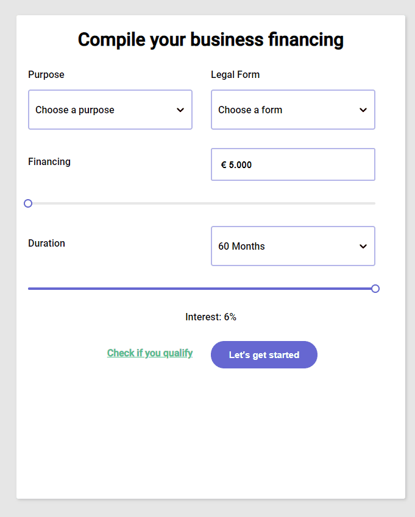

<h1 align="center">
  React Gatsby - Loan Calculator
</h1>
## 🚀 Quick start

1.  **Run Locally**

    Navigate into your new site’s directory and start it up.

    ```shell
    cd my-gatsby-site/
    npm run develop
    ```

2.  **Open the code!**

    Your site is now running at http://localhost:8000!

    Edit `src/pages/index.js` to see your site update in real-time!

3.  **Learn more**

    - [Documentation](https://www.gatsbyjs.com/docs/?utm_source=starter&utm_medium=readme&utm_campaign=minimal-starter)

    - [Tutorials](https://www.gatsbyjs.com/tutorial/?utm_source=starter&utm_medium=readme&utm_campaign=minimal-starter)

    - [Guides](https://www.gatsbyjs.com/tutorial/?utm_source=starter&utm_medium=readme&utm_campaign=minimal-starter)

    - [API Reference](https://www.gatsbyjs.com/docs/api-reference/?utm_source=starter&utm_medium=readme&utm_campaign=minimal-starter)

    - [Plugin Library](https://www.gatsbyjs.com/plugins?utm_source=starter&utm_medium=readme&utm_campaign=minimal-starter)

    - [Cheat Sheet](https://www.gatsbyjs.com/docs/cheat-sheet/?utm_source=starter&utm_medium=readme&utm_campaign=minimal-starter)

<p align="center">
  
</p>